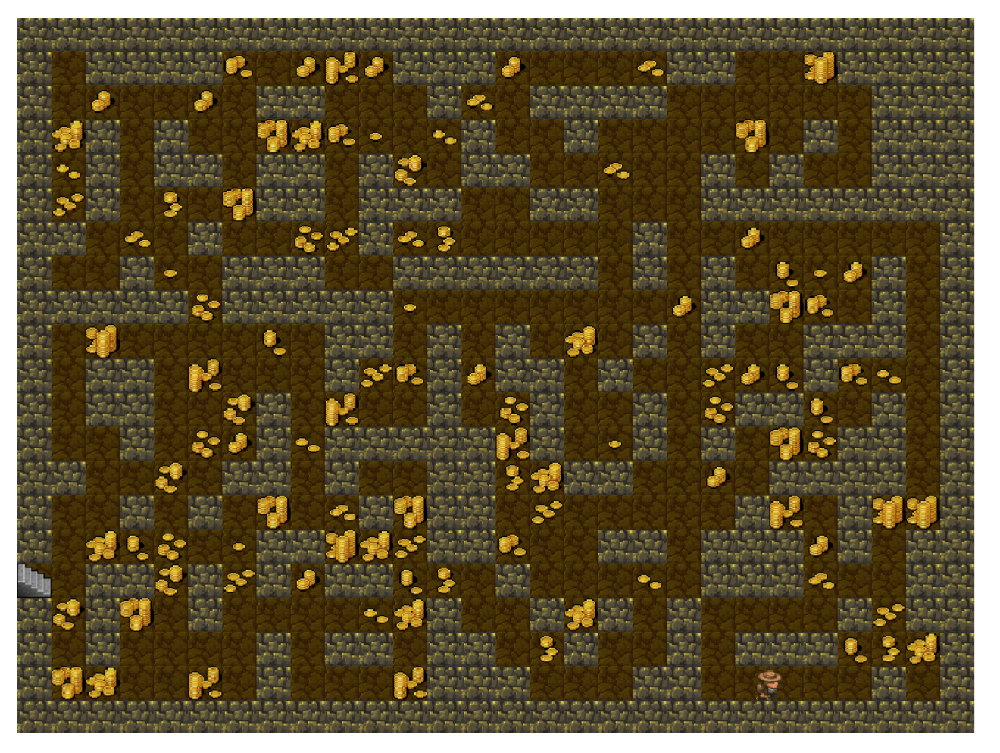

# Software Design and Programming

# Software and Programming III

## Individual Coursework II

#### Session: 2020-21

Objectives 
==========

The aims of this coursework assignment are to:

-   learn how to understand and extend an existing codebase,

-   focus on the essential (and relevant) packages within that codebase,
    
-   work with packages,

-   become accustomed to the features of modern Java,

-   to see the use of Java concurrency via the threading model,

-   to see the workings of a Java GUI application.

The code that you actually have to write is quite small but the amount you have to read is quite large. We will be running additional tutorials to help you with this assignment as we understand that it is complex but you will learn a great deal from completing the task.

Overview 
========

In this assignment, you will help the explorer and Professor of Archeology, Boris Johnson, claim the *Orb of Lots*, which is located in the *Temple of Gloom*. You will help him explore an unknown cavern under the temple, claim the orb, and escape before the entrance collapses. There will be great rewards for those who help Boris fill his pockets with gold on the way out. There are two major phases to this assignment:

-   the *exploration phase*, and

-   the *escape phase*,

each of which involves writing a separate method in Java. We explain these phases in detail after presenting some further introductory material.

Collaboration Policy and Academic Integrity 
===========================================

You may not look at anyone else's code, in any form, or show your code to anyone else, in any form. You may not show or give your code to another person in the class. While you can talk to others about the assignment at a high level, your discussions should not include writing code or copying it down. If you don't know where to start, if you are lost, etc., please contact one of the teaching team immediately. Do not wait. A little assistance can do wonders to get you off and running.

Regardless of the times you choose to push your changes to GitHub, you should commit early and often. In case of suspected plagiarism, your
version control history will be used as additional evidence to judge the case. It is in your best interest to commit very often (and to use adequate commit messages) to make it clear that the process of creation is entirely your own.

The exploration phase 
=====================

On the way to the Orb (see Figure [1](#1), the layout of the cavern is unknown. You know only the status of the tile on which you are standing and those immediately around you and perhaps those that you remember. Your goal is to make it to the Orb in as few steps as possible.

{#1 width="\\textwidth"}

This is not a blind search, as you will know the distance to the Orb. This is equal to the number of tiles on the shortest path to the Orb, if there weren't walls or obstacles in the way.

You will develop the solution to this phase in the method `explore()` in the class `Explorer` within package `student`. There is no time limit on the number of steps you can take, but you will receive a higher score for finding the Orb in fewer steps. To pick up the Orb, simply return from this method once you have arrived on its tile. Returning when Boris is not on the Orb tile will cause an exception to be thrown, halting the game.

When writing method `explore()`, you are given an `ExplorationState` object to learn about the environment around you. Every time you make a
move, this object automatically changes to reflect the new location of the explorer. This object includes the following methods:

`long getCurrentLocation()`: return a unique identifier for the tile the explorer is currently on.

`int getDistanceToTarget()`: return the distance from the explorer's current location to the Orb.

`Collection<NodeStatus> getNeighbours()`: return information about the tiles to which the explorer can move from their current location.

`void moveTo(long id)`: move the explorer to the tile with ID id. This fails if that tile is not adjacent to the current location.

Note that function `getNeighbours()` returns a collection of `NodeStatus` objects. This is simply an object that contains, for each neighbour, the ID corresponding to that neighbour, as well as that neighbour's distance from the Orb. You can examine the documentation for this class for more information on how to use `NodeStatus` objects. A suggested first implementation that will always find the Orb, but likely as not won't receive a large bonus score, is a depth-first search. More advanced solutions might incorporate the distance of tiles from the Orb.

The escape phase 
================

After picking up the Orb, the walls of the cavern shift and a new layout is generated --- ouch! In addition, piles of gold fall onto the ground. Luckily, underneath the Orb is a map, revealing the full cavern to you. However, the stress of the moving walls has compromised the integrity of the cavern, beginning a time limit after which the ceiling will collapse crushing Boris! Additionally, picking up the Orb activated the traps and puzzles of the cavern, causing different edges of the graph to have different weights.

{#2
width="\\textwidth"}

The goal of the escape phase is to make it to the entrance of the cavern before it collapses. However, a score component is based on two additional factors:

1.  The amount of gold that you pick up during the escape phase, and

2.  Your score from the exploration phase.

Your score will simply be the amount of gold picked up times the score from the exploration phase.

You will write your solution code to this part of the problem in a method `escape()` in the class `Explorer` in the package `student`. To escape, simply return from this method while standing on the entrance tile. Returning while at any other position, or failing to return before time runs out, will cause the game to end and result in a score of 0.

An important point to clarify is that *time* during this phase is not defined as the CPU time your solution takes to compute but rather the number of steps taken by the explorer: the time remaining decrements regardless of how long you spent deciding which move to make. Because of this, you can be guaranteed that you will always be given enough time to escape the cavern should you take the shortest path out. Note that there are differing amounts of gold on the different tiles. Picking up gold on the tile you are standing on takes no time.

When writing this method, you are given an `EscapeState` object to learn about the environment around you. Every time you make a move, this object will automatically change to reflect the new location of the explorer. This object includes the following methods:

`Node getCurrentNode()`: return the `Node` corresponding to the explorer's location.

`Node getExit()`: return the `Node` corresponding to the exit to the cavern (the destination).

`Collection<Node> getVertices()`: return a collection of all traversable nodes in the graph.

`int getTimeRemaining()`: return the number of steps the explorer has left before the ceiling collapses.

`void moveTo(Node n)`: move the explorer to node n. this will fail if the given node is not adjacent to the explorer's current location. Calling this function will decrement the time remaining.

`void pickUpGold()`: collect all gold on the current tile. This will fail if there is no gold on the current tile or it has already been collected.

Class `Node` (and the corresponding class `Edge`) has methods that are likely to be useful. Look at the documentation for these classes to learn what additional methods are available. A good starting point is to write an implementation that will always escape the cavern before time runs out. From there, you can consider trying to pick up gold to optimise your score using more advanced techniques.

However, the most important part is always that your solution successfully escapes the cavern----- if you improve on your solution, make sure that it never fails to escape in time!

The provided code 
=================

You will have downloaded the provided classes from `GitHub` by cloning this repository. The difference between this and previous worksheets/courseworks is that we have only given you the class files (don't reverse engineer the source code, that will ruin the point of the exercise). You should see four packages: `game`, `gui`, `student`, and `main`. The`student` package is where you will be writing your code.

The program can be run from two classes within the `main` package. Running the `main` method from the class `TXTmain` executes the program in headless mode (without a GUI); running it from `GUImain` runs it with an accompanying display, which may be helpful for debugging. By default, each of these runs a single map on a random seed. If you run the program before any solution code is written, you should see the explorer stand still and an error message pop up telling you that you returned from`explore()` without having found the Orb. You should start by trying this to check that the code compiles correctly.

Two optional flags can be used to run the program in different ways:

`-n <count>`: runs the program multiple times. This option is available only in headless mode and is ignored if run with the GUI. Output will still be written to the console for each map so you know how well you did, and an average score will be provided at the end. This is helpful for running your solution many times and comparing different solutions on a large number of maps.

`-s <seed>`: runs the program with a predefined seed. This allows you to test your solutions on particular maps that can be challenging or that you might be failing on and thus is quite useful for debugging. This can be used both with the GUI and in headless mode.

For instance, to run the program 100 times in headless mode, write:

    java main.TXTmain -n 100

To run the program once with a seed of 1050, write:

    java main.GUImain -s 1050   

You may combine these flags, but if you run the program more than once and provide a seed, it will run the program on the same map (the map generated by that seed) every time.

The GUI 
=======

When running your program (except in headless mode), you are presented with a GUI where you can watch the explorer making moves. When the GUI
is running, each call to `moveTo()` blocks until the corresponding move completes on the GUI ----- that is, when you make a call to `moveTo()`, that call will not return and consequently your code will not continue running until the corresponding animation on the GUI has completed. For that reason, running your code in headless mode will generally complete faster than running it with the GUI.

You can use the slider on the right side of the GUI to increase or decrease the speed of the explorer. Increasing the speed will make the animation finish faster. Decreasing the speed might be useful for debugging purposes and to get a better understanding of what exactly your solution is doing. Also, a timer displays the number of steps remaining during the escape phase (both as a number and a percentage). A `Print Seed` button allows you to print the seed to the console to easily copy and paste into the program arguments to retry your solution on a particularly difficult map. You can also see the `bonus` and the number of coins collected, followed by the final score computed as the product of these. The bonus multiplier begins as `1.3` and slowly decreases as you take more and more steps during the explore stage (after which it is fixed), while the number of coins increases as you collect them during the escape phase. Finally, click on any square in the map to see more detailed information about it on the right, including its row and column, the type of tile, and the amount of gold on that square.

The deliverables 
================

+ The assignment must follow the usual `add/commit/push` cycle; it will be automatically cloned on the due date as part of your portfolio submission. 
+ You must upload your classes, documentation, and unit tests, as part of your submission.
+ You should include full `javadoc` for your classes (most of which is provided for you anyway). 
+ You must include a `README_WHAT_I_DIDTH.md` file detailing what the project is about and any limitations/problems with your submission. It should also include a list of the files/classes you have created/modified.

You are encouraged to have everything ready well in advance ----- both the programming and pushing it to your `GitHub` account ----- to avoid any last-minute problems (e.g., `GitHub` may be down for maintenance).

Grading 
=======

The assignment will be graded according to its ability to fulfil the requirements; the simplicity, clarity, and generality of the code (including succinct but illustrative comments and `JavaDoc`); and the compliance with good practices of coding, and version control as outlined during the module (e.g., committing often and in small pieces, use of descriptive commit messages, committing only source code and not binary or `.class` files).

The vast majority of points on this assignment will come from a correct solution that always finds the Orb and escapes before the time runs out, so your priority should be to make sure that your code always does this successfully. To receive full credit for the assignment, your solution must also get a reasonably high score (achieved by optimising the bonus multiplier in the explore phase and collecting as many coins as possible in the escape phase), so you should spend some time thinking about waysto optimise your solution. While the amount of time your code takes to decide its next move does not factor into the number of steps taken or the time remaining and consequently does not effect your score, we cannot wait for your code forever and so must impose a timeout when grading your code. When run in headless mode, your code should take no longer than roughly 10 seconds to complete any single map. Solutions that take significantly longer may be treated as if they did not successfully complete and will likely receive low grades. 

The use of Java Reflection mechanisms in any way is strictly forbidden and will result in significant penalties.

Credits 
=======

Thank you to Eric Perdew, Ryan Pindulic, and Ethan Cecchetti from the Department of Computer Science at Cornell for the basis of this coursework.
